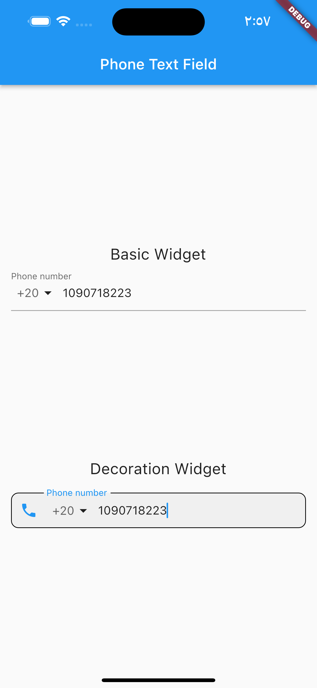
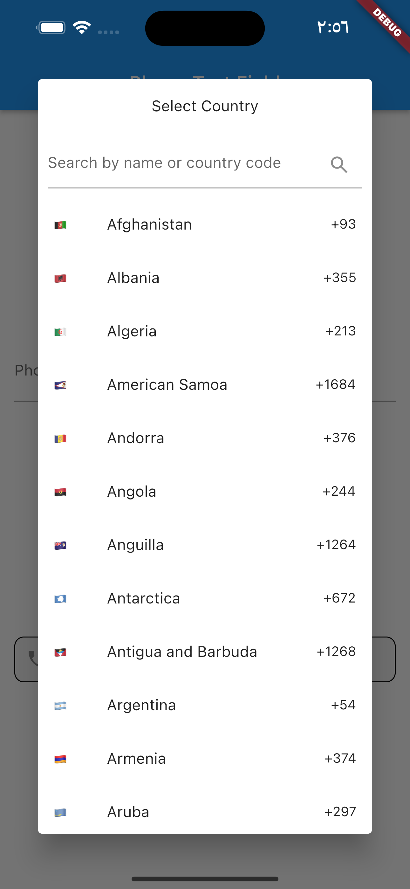
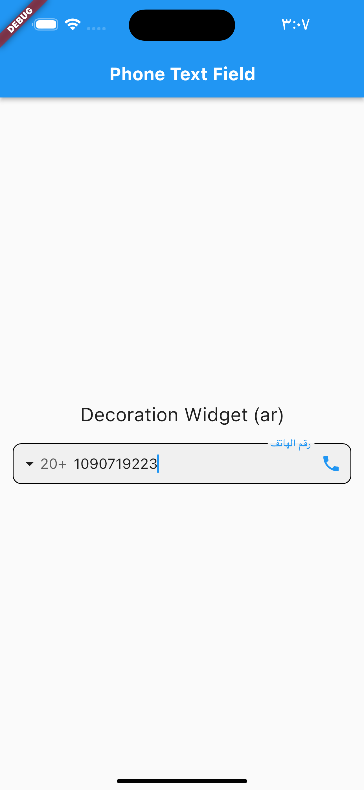
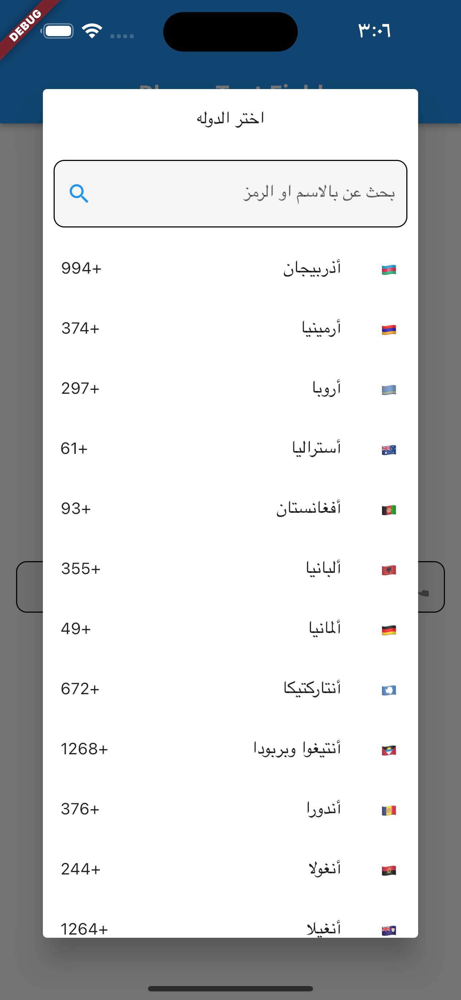

# phone_text_field_plus

Phone TextField Plus is a Flutter plugin that lets you parse, validate, format, and manage other utilities for international numbers with localization support based on (phone_text_field package).

[](https://pub.dev/packages/phone_text_field_plus)

## Demo gif


## Installation

1. Add this to your package's `pubspec.yaml` file:

```yaml
dependencies:
  phone_text_field_plus: any
```

1. Get the package using your IDE's GUI or via command line with

```bash
$ pub get
```

1. Import the `phone_text_field_plus.dart` file in your app

```dart
import 'package:phone_text_field_plus/phone_text_field_plus.dart';
```

## Features

- Validate phone number
- Select country code
- Support arabic & english & french
- add textController

## Usage

default widget

```dart
PhoneTextField(
    onChanged: (value) {},
),
```

custom text style

```dart
                PhoneTextField(
                  locale: const Locale('en'),
                  decoration: const InputDecoration(
                    filled: true,
                    contentPadding: EdgeInsets.zero,
                    enabledBorder: OutlineInputBorder(
                      borderRadius: BorderRadius.all(Radius.circular(10.0)),
                      borderSide: BorderSide(),
                    ),
                    focusedBorder: OutlineInputBorder(
                      borderRadius: BorderRadius.all(Radius.circular(10.0)),
                      borderSide: BorderSide(),
                    ),
                    prefixIcon: Icon(Icons.phone),
                    labelText: "Phone number",
                  ),
                  searchFieldInputDecoration: const InputDecoration(
                    filled: true,
                    enabledBorder: OutlineInputBorder(
                      borderRadius: BorderRadius.all(Radius.circular(10.0)),
                      borderSide: BorderSide(),
                    ),
                    focusedBorder: OutlineInputBorder(
                      borderRadius: BorderRadius.all(Radius.circular(10.0)),
                      borderSide: BorderSide(),
                    ),
                    suffixIcon: Icon(Icons.search),
                    hintText: "Search country",
                  ),
                  initialCountryCode: "AE",
                  onChanged: (phone) {
                    debugPrint(phone.completeNumber);
                  },
                ),
```

arabic style

```dart
                PhoneTextField(
                  locale: const Locale('ar'),
                  decoration: const InputDecoration(
                    filled: true,
                    contentPadding: EdgeInsets.zero,
                    enabledBorder: OutlineInputBorder(
                      borderRadius: BorderRadius.all(Radius.circular(10.0)),
                      borderSide: BorderSide(),
                    ),
                    focusedBorder: OutlineInputBorder(
                      borderRadius: BorderRadius.all(Radius.circular(10.0)),
                      borderSide: BorderSide(),
                    ),
                    prefixIcon: Icon(Icons.phone),
                    labelText: "رقم الهاتف",
                  ),
                  searchFieldInputDecoration: const InputDecoration(
                    filled: true,
                    enabledBorder: OutlineInputBorder(
                      borderRadius: BorderRadius.all(Radius.circular(10.0)),
                      borderSide: BorderSide(),
                    ),
                    focusedBorder: OutlineInputBorder(
                      borderRadius: BorderRadius.all(Radius.circular(10.0)),
                      borderSide: BorderSide(),
                    ),
                    suffixIcon: Icon(Icons.search),
                    hintText: "بحث عن بالاسم او الرمز",
                  ),
                  dialogTitle: "اختر الدوله",
                  initialCountryCode: "AE",
                  onChanged: (phone) {
                    debugPrint(phone.completeNumber);
                  },
                ),
```

## Screenshots


local(en)



local(ar)



## Contributions

## Main Contributors

<table>
  <tr>
    <td align="center"><a href="https://github.com/bousalem98"><br /><sub><b>Mohamed Salem</b></sub></a></td>
    <td align="center"><a href="https://github.com/MohamedAbd0"><br /><sub><b>Mohamed Abdo Elnashar</b></sub></a></td>
  </tr>
</table>
<br/>
